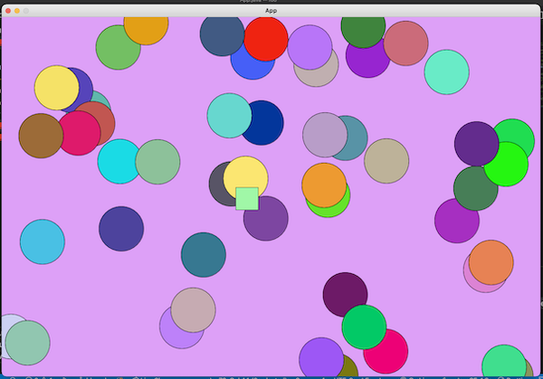

# Processing Example

A simple example of an animation using the Processing framework in Java. Some notes:

- The main class, `App`, inherits from Processing's `PApplet` class.
- The custom class, `Bubble`, represents a circle.
- Each `Bubble` object encapsulates its own position, and speed of movement. Each `Bubble` also contains methods to draw themselves to the window and to check whether a given `x`,`y` coordinate falls within the bubble.
- The `App` class instantiates many `Bubble` objects at random positions and tells them all to draw themselves to the screen at their `x`,`y` coordinates.
- When the user clicks the mouse, the `App` class code checks whether the click occurred within the area of any of the `Bubble` objects, and removes that bubble from the window if so.



## Technical requirements

This project depends upon the [Processing](http://processing.org/) library. The `.jar` files for this dependency are included within the `lib` directory.

However, Processing currently works only with Java 8. In order to have the Java Extensions for Visual Studio Code run the program with Java 8, instead of any newer version, you must do the following:

1. Download and install the [jdk8u242-b08 version of OpenJDK 8](https://github.com/AdoptOpenJDK/openjdk8-binaries/releases/tag/jdk8u242-b08) - on MacOS, select the appropriate `.pkg` file; for Windows, select the appropriate `.msi` file (be sure to select the file with `jdk` in its name, not the one with `jre` in its name).
1. Note the file path to the directory where this new JDK was installed. We'll refer to this directory later as `THE_PATH_TO_JDK_8`.
   - On Mac, it is probably in `"/Library/Java/JavaVirtualMachines/adoptopenjdk-8.jdk/Contents/Home"`. Note the inclusiong of `Contents/Home` at the end of the path - we'll need it with this addition in the settings file.
   - On Windows, it is probably in `C:\Program Files (x86)\AdoptOpenJDK\jdk-8.0.242.08-hotspot`, which would have to have its back slashes escaped to be `"C:\\Program Files (x86)\\AdoptOpenJDK\\jdk-8.0.242.08-hotspot"` in the settings file.
1. In Visual Studio Code, go to Settings (MacOS: `Code`->`Preferences`->`Settings`; Windows: `File`->`Preferences`->`Settings`), and enter "`java jdt ls java home` in the search field. You should see an option with a link to `Edit in settings.json` - click that link to open that file in the editor.
1. In the `settings.json`, edit the "`java.configuration.runtimes`" setting so that it includes the new JDK. If there is no such setting currently, add it. If the setting exists, and an existing JDK is listed there, you an keep both. For example (replace `THE_PATH_TO_JDK_8` with the correct path for your newly-installed JDK) :
   ```javascript
   "java.configuration.runtimes": [
       {
       "name": "JavaSE-1.8",
       "path": "THE_PATH_TO_JDK_8",
       "default": true
       },
       {
       "name": "JavaSE-15",
       "path": "THE_PATH_TO_AN_EXISTING_JDK",
       "default": false
       }
   ],
   ```
1. With this project open, go to Visual Studio Code's Command Palette (`View`->`Command Palette`) and search for "`Java: Configure Java Runtime`". Click on the matching option that appears.
1. In the `Configure Java Runtime` setting document, click the icon to edit the current runtime setting for this project and change it to the newly-installed JDK.
1. In the Command Palette again (`View`->`Command Palette`), search for "`Java: Clean Language Server Workspace`". Click the matching option that appears and confirm that you would like to reset the Java language server.

At this point, the project should run properly. Try it out.

## Folder structure

This project has several important directories:

- `images` - image files referred to by the code
- `src` - contains the Java source code for the project (i.e. `.java` files)
- `test` - contains code that will help us determine whether the code you have written works correctly. Do not touch this directory!
- `bin` - contains the compiled code (i.e. `.class` files)
- `lib` - contains any dependencies (other libraries of code that the project depends upon to work)

If your project has no dependencies and has not been compiled, you may not see the `lib` or `bin` directories.
